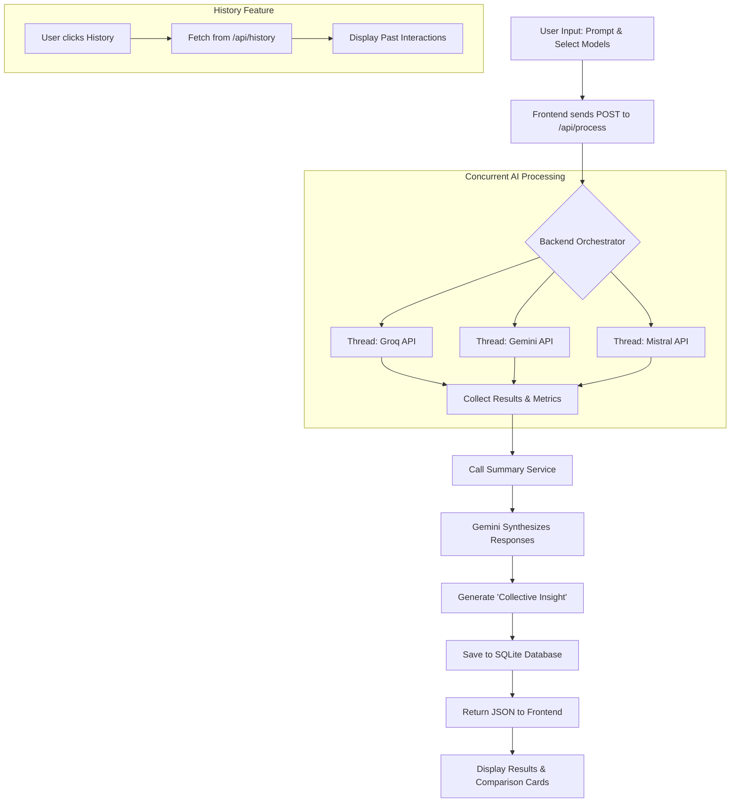

# Website Algorithm & Workflow Explanation

This document explains the technical architecture, algorithms, and logical flow of the CCPS (Cyber Crime Prevention System) project.

## 1. System Architecture Overview

The application follows a standard **Client-Server architecture**:
- **Frontend**: A React.js application providing a modern, interactive dashboard.
- **Backend**: A Python Flask server that acts as an orchestrator for multiple AI models.
- **Database**: SQLite is used for persistent storage of user prompts, model responses, and synthesized insights.
- **AI Integration**: The system connects to external LLM APIs (Groq, Google Gemini, Mistral AI) to fetch and compare results.

---

## 2. Core Algorithm: Multi-Model Processing & Synthesis

The main logic resides in the `/api/process` endpoint. The algorithm follows these steps:

### Phase 1: Input & Orchestration
1. **Receive Request**: The backend receives a JSON payload containing the user's `prompt` and a list of `selected_models`.
2. **Model Selection**: The server identifies which service functions to call based on the user's selection (e.g., `get_groq_response`, `get_gemini_response`).

### Phase 2: Concurrent Execution
3. **Multi-Threading**: To minimize waiting time, the system uses Python's `threading` library to fetch responses from all selected models simultaneously.
4. **Data Collection**: For each model:
    - Measure the time taken to respond.
    - Calculate the word count of the output.
    - Capture the response text.

### Phase 3: AI Synthesis (Meta-Prompting)
5. **Summarization**: Once all responses are collected, they are passed to the `summary_service`.
6. **Synthesis Logic**: A "Meta-Prompt" is constructed. This prompt includes the original user request and all individual AI responses.
7. **Collective Insight**: Google Gemini (Flash) is used as an "AI Synthesis Expert" to read all responses and generate a single, high-quality consolidated summary (the "Collective Insight").

### Phase 4: Persistence
8. **Storage**: The interaction (prompt + summary) is saved to the `interactions` table.
9. **Relational Link**: The individual model results are saved to the `responses` table, linked via a Foreign Key to the interaction ID.

---

## 3. System Flowchart

The following flowchart visualizes the entire process from user input to final display.

---

## 4. Key Components

### Backend Services
- **`app.py`**: The entry point. Handles routing, threading logic, and database transactions.
- **`database.py`**: Manages SQLite connections and schema initialization.
- **`groq_service.py` / `gemini_service.py` / `mistral_service.py`**: Modular wrappers for different AI provider SDKs.
- **`summary_service.py`**: Specialized logic for synthesizing multiple outputs into one.

### Database Schema
- **`interactions` table**: Stores `id`, `prompt`, `summary`, and `timestamp`.
- **`responses` table**: Stores `interaction_id`, `model_name`, `response_text`, `word_count`, and `response_time`.

---

## 5. Sequence of Operations

1. **Initialization**: On startup, `init_db()` ensures the SQLite database and tables exist.
2. **Processing**:
    - User types "What is phishing?" and selects Groq and Gemini.
    - Backend starts two threads.
    - Groq returns a technical definition (2.1s, 50 words).
    - Gemini returns a common-sense explanation (1.5s, 60 words).
    - `summary_service` combines both into a 3-sentence "Collective Insight".
    - Data is saved.
3. **Presentation**: The frontend renders a comparison view with time/word metrics and the consolidated summary at the top.
